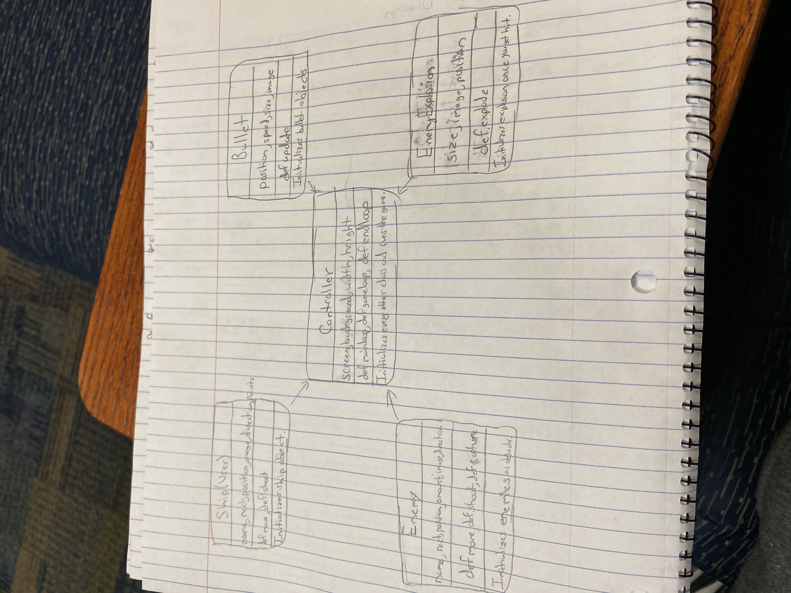

# BattleFrog

#### George, Travis, Aryan

***

## Project Description
Battle Frogs is a fixed shooter in which the player controls a laser cannon by moving it horizontally across the bottom of the screen and firing at enemies. There are three levels and once all enemies die you win the game. There is also a scoring system.

***

## User Interface Design
1. Main Menu/Start Screen

This screen is the first thing a user sees. It gives the user the option to begin playing the game by clicking “Start,” exit out of the game by clicking “Quit”.

2.Game Screen
This screen is the game screen. It displays the User's ship, enemies, boss, bullets, and general game functions.

3. Game Over Screen
This screen is the Game Over screen. It displays the exit button and your score.

4. Victory Screen
This screen is the Victory screen. It displays the exit button and your score.

***

## Program Design
* Non-Standard libraries
    * None
* Class Interface Design
    * A simple drawing that shows the class relationships in our code (see below for an example).
        * 
* Classes
    * __Ship__ - A class that defines the ship - a frog that the user can move (left or right) and shoot. The class itself defines the size and placement pattern of the ship in the game window.
    * __Bullets__ - A class that defines the “active” object of the game - a bullet that is “fired” by the space bar, and then proceeds to go forward until it collides with an enemy or goes out of the screen.
    * __Enemy_Bullets__ - A class that defines the “active” object of the game - a bullet that is “fired” by the enemy ship, and then proceeds to go forward until it collides with the user or goes out of the screen.
    * __Enemy__ - A class that defines the enemy - ships that are moving horizontally and the first row shoots bullets. If the bullet from hits the ship your health lowers.
    * __Boss_Enemy__ - A class that defines the boss of the game - another enemy that moves horizontally and if destroyed points are multiplied.
    * __Buttons__ - A minor class that stores the functions for the button keys - stores the start and close button.
    * __Life__ - A minor class that defines the health of the ship - the user starts with three health.
    * __Controller__ - A class that defines the “rules” and logic of the interlocking relationships between the other classes and UI, as well as establishes the data permanence of the high score, the sound effects and musical playback, and opens the actual game window itself. The collision functions, key bindings, and refresh rate are established here, and it calls each of the prior classes and their UI elements to “load” them when ran.

***

## Testing
* 1. __Menu Testing__
     First, we run Controller() and ensure the main menu opens normally, music also played as intended.

     We then press the MAIN MENU button and return, checking that the same functionality with button hover. Afterwards, we tested the QUIT button on the Main Menu to see if it properly closes the game. We then test the Start button Main Menu page to make sure that the Game screen opens properly.

* 2. __Game Testing__
     When the Game screen boots up , we test if clicking the start button starts the game, so we test to see if this remains true. From there, in the middle of play, we will test the single-press of both the left and right arrow buttons to make sure movement works in single presses.

     From here, we conduct normal play-testing to ensure that the collisions, the speed of the bullet, and the dynamic functions(sound effects) are all working together meaningfully and without any obvious error. We also check that the destruction of a enemy ship does in fact increase the score. Once all enemies die the board resets and the enemies' movement increases.

     We then try to reach a win state, we beat all three levels and the Victory screen and the high score screen appears. We also tested to see if killing the boss will give us a two time multiplier, it successfully worked. We then purposefully reach fail-state, to test the GAME OVER screen. We checked if the ship takes damage if it collides with an enemy, it worked.

* ATP

| Step                  | Procedure     | Expected Results  | Actual Results |
| ----------------------|:-------------:| -----------------:| -------------- |
|  1  | Run Controller()  | 1) Main Menu opens normally and is functional displays the "Start" button and "Quit" button 2) Menu music starts playing |          |
|  2  | Click "Play" button | 1) Game screen opens and displays the ship and enemies 2) Music stops |                 |
|  3  | Press LEFT ARROW  | Ship moves to the left when pressed once |               |
|  4  | Press RIGHT ARROW  | Ship moves to the right when pressed once |                 |
|  5  | Press SPACE BAR | Ship shoots up when pressed once also makes a sound effect |                 |
|  6  | General play testing  | 1) Enemies spawn and moves horizontally while shooting (checked to see if sound effect works) 2) Ship spawns in the bottom center 3) Hitting the enemies from all parts works as intended and there are no glitches(sound effect works as intended), also disappears once bullet hits 4) Score is displayed and increase as enemies die 5) enemy boss spawns, killing it gives you 2x multiplier 6) Once every enemy dies the board resets and movement of the enemies increase 6) If collides with enemy takes damage |                 |
|  7  | Attempt to reach win state  | 1) There are three levels. We beat all three levels, the Victory screen appears, which displays your score and quit button. |                 |
|  8  | Force fail state | 1) Ship disappears 2) GAME OVER menu appears 3) Buttons works as intended 4) Displays your score |                 |
|  9  | Test each button on the fail state page | Quit - closes the game  |                 |
|  10  | Re-open game to test QUIT buttons | Main menu QUIT button closes the game properly  |                 |
|  11  | Click red "X" button in the top corner of window | Game closes out properly |                 |

